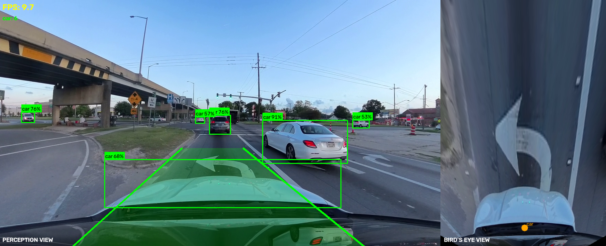
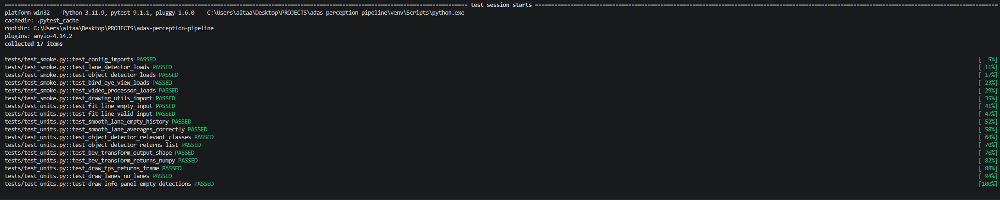

# ADAS Perception Pipeline

[](https://github.com/shaikaltaaf123/adas-perception-pipeline/actions/workflows/tests.yml)

A perception pipeline for dashcam footage that combines object detection, lane detection, depth estimation, and bird's eye view transformation. Object detection uses YOLOv8, depth estimation uses MiDaS, and lane detection / bird's eye view use classical OpenCV techniques.

---

## Demo



---

## What It Does

- **Object Detection** — detects cars, pedestrians, cyclists, trucks, buses, traffic lights and stop signs using YOLOv8s
- **Lane Detection** — detects and draws left and right lane boundaries using Hough Transform with temporal smoothing across 5 frames
- **Depth Estimation** — estimates relative depth for each frame using MiDaS and labels each detected object as CLOSE / MED / FAR
- **Bird's Eye View** — transforms the camera perspective to a top-down map showing object positions relative to the ego vehicle
- **Collision Warning** — flashing warning when a vehicle or pedestrian is detected close and directly ahead
- **Dual View Output** — side by side perception view and bird's eye view saved as output video

---

## Known Limitations

- **Depth is relative, not metric** — MiDaS outputs a per-frame normalized depth map (0-1), not real-world distances in meters. The CLOSE/MED/FAR labels and collision warning are based on this relative scale, which can shift between frames depending on scene content, and should not be treated as calibrated distance measurements.
- **Lane detection assumes straight highway roads with clear markings** — the Hough Transform + ROI approach works best on well-marked, mostly-straight lanes. Curved roads, faded or missing markings, heavy traffic occlusion, and non-highway environments (city streets, intersections) will degrade or break lane detection.

---

## Architecture

Dashcam Video
↓
VideoProcessor (utils/video.py)
↓
Per Frame Pipeline
├── ObjectDetector — YOLOv8s, COCO classes filtered to ADAS relevant
├── LaneDetector — Canny edges → ROI mask → Hough lines → temporal smoothing
├── DepthEstimator — MiDaS small model, runs every 3 frames
└── BirdEyeView — Perspective transform → object projection
↓
DrawingUtils (utils/drawing.py)
↓
Side-by-side output video

---

## Tech Stack

| Component | Technology |
|---|---|
| Object Detection | YOLOv8s (Ultralytics) |
| Lane Detection | OpenCV — Canny + Hough Transform |
| Depth Estimation | MiDaS Small (PyTorch Hub) |
| Bird's Eye View | OpenCV Perspective Transform |
| Framework | PyTorch |
| Video Processing | OpenCV |
| Testing | Pytest — 17 tests |

---

## Project Structure

adas-perception-pipeline/
├── modules/
│ ├── object_detection.py # YOLOv8 wrapper with ADAS class filtering
│ ├── lane_detection.py # Hough transform + temporal smoothing
│ ├── depth_estimation.py # MiDaS depth model wrapper
│ └── bird_eye_view.py # Perspective transform + object projection
├── utils/
│ ├── drawing.py # Visualization, collision warning
│ └── video.py # Video reader/writer
├── tests/
│ ├── test_smoke.py # Module load tests
│ └── test_units.py # Function level unit tests
├── config.py # All parameters in one place
├── main.py # Pipeline entry point
└── data/ # Place input videos here

---

## Getting Started

### Prerequisites

- Python 3.10 or 3.11
- A dashcam or traffic video file

### 1. Clone the repository

```bash
git clone https://github.com/shaikaltaaf123/adas-perception-pipeline.git
cd adas-perception-pipeline
```

### 2. Create virtual environment

```bash
python -m venv venv
venv\Scripts\activate        # Windows
source venv/bin/activate     # Mac/Linux
```

### 3. Install dependencies

```bash
pip install -r requirements.txt
```

### 4. Add your video

Place any dashcam video in the `data/` folder and rename it to `traffic.mp4`

### 5. Run the pipeline

```bash
python main.py --video data/traffic.mp4 --output output/result.mp4
```

Press **Q** to stop. Output is saved to `output/result.mp4`

---

## Configuration

All parameters are in `config.py` — no need to touch any other file to tune the pipeline:

```python
MODEL_SIZE = "yolov8s.pt"          # swap to yolov8n.pt for faster processing
CONFIDENCE_THRESHOLD = 0.5          # lower for more detections
DEPTH_SKIP_FRAMES = 3               # run depth every N frames
LANE_SLOPE_THRESHOLD = 0.4          # minimum slope to count as a lane line
BEV_OUTPUT_SIZE = (400, 600)        # bird's eye view dimensions
```

---

## Run Tests

```bash
pip install pytest
pytest tests/ -v
```



---

## Command Line Options

```bash
python main.py --video path/to/video.mp4    # custom video path
               --output path/to/output.mp4  # custom output path
               --no-window                  # run without display
               --skip-depth                 # skip depth estimation for faster FPS
```

---

## Author

**Altaaf Shaik**
GitHub: [@shaikaltaaf123](https://github.com/shaikaltaaf123)